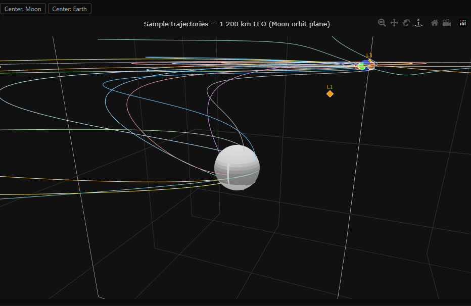

# Lunar Mass Driver — Orbital Suitability Simulator

A browser-based tool for evaluating launch sites on the Moon's surface for a mass driver system. Given a target orbit, it sweeps every candidate site and launch direction, runs CR3BP trajectory propagations, and maps the minimum circularisation ΔV required to reach the destination — so you can see at a glance which parts of the lunar surface are best suited for a mass driver.

## Screenshots

**Full UI — suitability map + selected-site trajectory**


**3-D trajectory view — all sample trajectories to 1 200 km LEO**



---

## Installation

```bash
pip install -r requirements.txt
python app.py
```

Then open [http://localhost:8050](http://localhost:8050).

---

## How to use it

### 1. Select a destination

Use the **Destination** dropdown in the top-right corner to pick a target orbit. Currently available:

- **1 200 km LEO (Moon orbit plane)** — a circular low-Earth orbit at 1 200 km altitude in the plane of the Moon's orbit.

### 2. Configure sweep parameters (optional)

The controls panel at the bottom lets you tune how densely the launch envelope is sampled before hitting **Calculate**:

| Control | What it does |
|---|---|
| **Azimuths** | Number of compass headings to test (equally spaced 0°–360°) |
| **Max elevation (°)** | Maximum above-horizontal launch angle |
| **Elevation steps** | How many elevation angles between 0° and the maximum |
| **Speed candidates** | Number of muzzle speeds sampled between 2.2 and 2.9 km/s |
| **Insertion** | Circularisation burn direction: prograde, retrograde, or cheapest of both |

The chip row below the controls shows the resulting propagation count per site so you know what you're asking for before you click.

### 3. Calculate

Click **Calculate**. A progress bar and live counter show how many of the ~70 grid sites and how many propagations have completed. Results are cached on disk; subsequent runs with the same parameters load instantly. Click **Recalculate** to force a fresh run.

### 4. Read the suitability map

The left panel shows a colour-coded heatmap of the Moon's surface overlaid on a photograph. Each cell is the minimum ΔV (km/s) achievable from that latitude/longitude across all tested launch directions and speeds:

- **Green** — low ΔV, favourable site
- **Red/orange** — high ΔV, unfavourable
- **Grey** — no valid trajectory found (e.g. impacts Moon or escapes)

Arrows on each cell indicate the optimal launch azimuth.

### 5. Inspect a site

Click any cell on the map to select it. The 3-D trajectory view on the right updates to show the best trajectory from that specific site. The selected cell is highlighted on the map. Click the same cell again to deselect and return to the overview trajectories.

### 6. Navigate the 3-D view

Use the Plotly toolbar in the top-right of the 3-D panel to orbit, zoom, and pan. The **Center: Moon** and **Center: Earth** buttons above the panel shift the rotation pivot to either body.

---

## Cache

Results are stored in `cache/` as `.npz` files keyed by destination, grid resolution, and sweep parameters. Delete a file to force recomputation, or click **Recalculate** in the UI.
