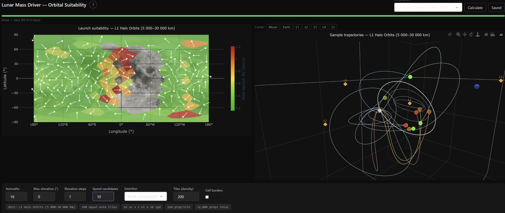
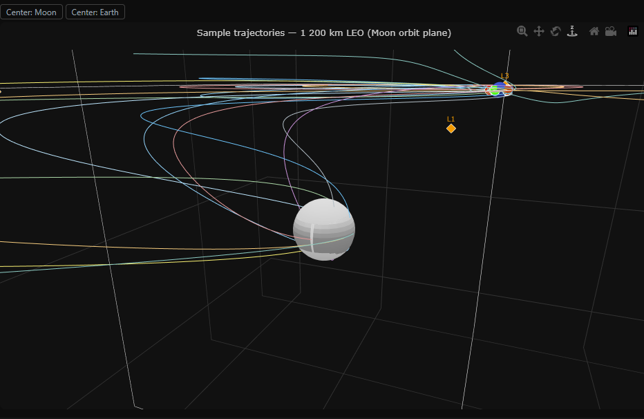

# Lunar Mass Driver — Orbital Suitability Simulator

A browser-based tool for evaluating launch sites on the Moon's surface for a mass driver system. Given a target orbit, it sweeps every candidate site and launch direction, runs CR3BP trajectory propagations, and maps the minimum circularisation ΔV required to reach the destination — so you can see at a glance which parts of the lunar surface are best suited for a mass driver.

## Screenshots

**Full UI — suitability map + selected-site trajectory**



**3-D trajectory view — all sample trajectories to 1 200 km LEO**



---

## Installation

```bash
pip install -r requirements.txt
python app.py
```

Then open [http://localhost:8050](http://localhost:8050).

---

## How to use it

### 1. Select a destination

Use the **Destination** dropdown in the top-right corner to pick a target orbit. Currently available:

- **1 200 km LEO (Moon orbit plane)** — a circular low-Earth orbit at 1 200 km altitude in the plane of the Moon's orbit.
- **L1 Halo Orbits / L1 Lyapunov Orbits** — northern halo and planar Lyapunov families about Earth–Moon L1 (5 000–30 000 km amplitude).
- **L1 Halo + Lyapunov Orbits** — both L1 families as a single target set; the cheapest insertion onto any orbit wins.
- **L2 Halo Orbits / L2 Lyapunov Orbits / L2 Halo + Lyapunov Orbits** — the same families about L2.
- **L4 / L5 Sun-synchronized Quasi-periodic Orbits** — long-period libration orbits about the triangular points.

### 2. Configure sweep parameters (optional)

The controls panel at the bottom lets you tune how densely the launch envelope is sampled before hitting **Calculate**:

| Control | What it does |
|---|---|
| **Azimuths** | Number of compass headings to test (equally spaced 0°–360°) |
| **Max elevation (°)** | Maximum above-horizontal launch angle |
| **Elevation steps** | How many elevation angles between 0° and the maximum |
| **Speed candidates** | Number of muzzle speeds sampled between 2.2 and 2.9 km/s |
| **Insertion** | Insertion burn direction: prograde, retrograde, or cheapest of both |
| **Tiles (density)** | Number of launch sites. The Moon's surface is divided into this many equal-area cells (Fibonacci lattice with Voronoi boundaries), and each cell's centre is one site. Default 80 |

The chip row below the controls shows the resulting propagation count per site so you know what you're asking for before you click.

### 3. Calculate

Click **Calculate**. A progress bar and live counter show how many of the tiles and how many propagations have completed. Results are cached on disk; subsequent runs with the same parameters load instantly. Click **Recalculate** to force a fresh run.

### 4. Read the suitability map

The left panel shows a colour-coded heatmap of the Moon's surface overlaid on a photograph. Each equal-area cell shows the minimum ΔV (km/s) achievable from the launch site at its centre across all tested launch directions and speeds:

- **Green** — low ΔV, favourable site
- **Red/orange** — high ΔV, unfavourable
- **Grey** — no valid trajectory found (e.g. impacts Moon or escapes)

Arrows on each cell indicate the optimal launch azimuth.

### 5. Inspect a site

Click any cell on the map to select it. The 3-D trajectory view on the right updates to show the best trajectory from that specific site. The selected cell is highlighted on the map. Click the same cell again to deselect and return to the overview trajectories.

### 6. Navigate the 3-D view

Use the Plotly toolbar in the top-right of the 3-D panel to orbit, zoom, and pan. The **Center: Moon** and **Center: Earth** buttons above the panel shift the rotation pivot to either body.

---

## Limitations

This is a screening tool for comparing sites against each other. Its ΔV figures are not mission-design numbers. The main simplifications:

### Dynamics model

- **Circular Restricted Three-Body Problem (CR3BP) only.** Earth and Moon are point masses on circular orbits. The model leaves out the Moon's orbital eccentricity (e ≈ 0.055, which moves it about ±21 000 km), solar gravity, solar radiation pressure, and the non-spherical gravity of both bodies (lunar mascons, Earth J2).
- **No launch epoch.** The CR3BP rotating frame does not depend on time, so a result is the same for every launch date. Real windows depend on the Moon's position in its eccentric, inclined orbit and on the Sun's direction.
- **L4/L5 "Sun-synchronized" orbits are geometric stand-ins.** The model has no Sun, so these orbits are long-period CR3BP libration tori labelled after the real-world regime they represent. The solar resonance that defines that regime is not simulated.
- **Idealised Moon.** The Moon is a smooth sphere (R = 1 737.4 km) locked exactly to the rotating frame, with its spin axis along the orbit normal. The model ignores physical libration, the ~6.7° tilt of the lunar equator to its orbit plane, and terrain. A shallow launch that would hit a crater rim or mountain is still treated as clear.
- **LEO target is in the Moon's orbit plane**, not Earth's equator. These planes differ by roughly 18°–29° over the 18.6-year nodal cycle.

### Launch model

- The mass driver gives an **instantaneous velocity at the surface**, with no track length, acceleration profile, or exit-point offset.
- **Mass-driver energy is not counted.** The map shows only on-board ΔV spent after launch.
- Muzzle speeds are limited to **2.2–2.9 km/s**, and elevation runs from 0° up to the configured maximum. A trajectory outside that envelope is never found.
- The model ignores dispersion: launch velocity errors, pointing errors, and how sensitive a trajectory is to them. A site with a low ΔV might rely on a launch window too narrow to hit in practice.

### ΔV cost model

- The model allows **one impulsive burn and no mid-course corrections**. It does not optimise a multi-burn transfer.
- **LEO:** the burn happens at the *first inbound crossing* of the 1 200 km radius, not at an optimised periapsis, and its cost includes any plane change. A trajectory whose periapsis stays *above* 1 200 km never crosses that radius, so it is reported as unreachable even if a small burn would capture it.
- **L1/L2/L4/L5:** the burn happens where the trajectory first enters a capture sphere: 34 600 km around L1/L2, or 123 000 km around L4/L5. ΔV is the velocity mismatch with the *nearest point* on the closest target orbit. **The position mismatch is ignored**, and it can be thousands of km. Read these numbers as a relative proxy, not a true rendezvous cost.
- The target orbit families are finite, discrete sets. The model includes no station-keeping cost after insertion.

### Search and numerics

- **Brute-force grid search.** The minimum ΔV comes from sampled azimuth, elevation, and speed values, with no local refinement afterwards. Narrow windows can fall between samples; for LEO, the useful speed band is only about 0.1 km/s wide. Results improve as sampling gets denser, but they are only ever an upper bound on the true minimum.
- **One site per tile.** Each tile's colour shows the value at its centre only, and nothing varies within a cell.
- **Finite time horizons.** Propagations stop after ~35 days (LEO), ~52 days (L1/L2), or ~130 days (L4/L5), or once a trajectory goes beyond 3.5 Earth–Moon distances. Slower transfers, such as low-energy or weak-stability-boundary routes, are counted as unreachable.
- **Integrator tolerances are set for speed** (`rtol` 1e-7 to 1e-8). Trajectories near Lagrange points, or ones that pass close to the Moon, are chaotic, so individual results can be sensitive to tolerance and step size.

### Out of scope

The sim does not model payload mass and structural limits, power and thermal constraints, lighting, Earth visibility or communications, lunar dust, or the fate of payloads that miss their target, such as re-impact or debris.

---

## Cache

Results are stored in `cache/` as `.npz` files keyed by destination, tile count, and sweep parameters. Delete a file to force recomputation, or click **Recalculate** in the UI.
